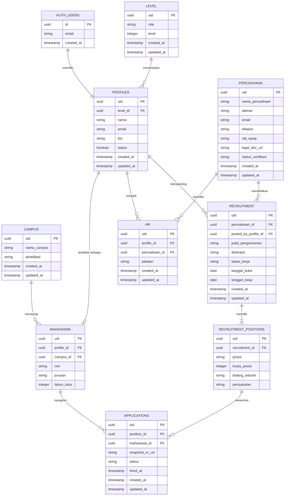

# BKK System

Sistem BKK untuk mengelola pengguna, perusahaan, lowongan pekerjaan, mahasiswa, dan lamaran kerja. Aplikasi terdiri dari backend Express yang terhubung ke Supabase dan frontend React + Vite.

## Teknologi

- **Frontend:** React, TypeScript, Vite, Material UI
- **Backend:** Node.js, Express
- **Database dan autentikasi:** Supabase

## ERD

Diagram berikut menggambarkan relasi tabel yang digunakan oleh backend dan dokumentasi API.



### Penjelasan relasi

| Relasi | Keterangan |
| --- | --- |
| `auth.users` → `profiles` | Satu akun Supabase memiliki satu profil aplikasi. `profiles.uid` menyimpan ID dari `auth.users.id`. |
| `level` → `profiles` | Satu level dapat digunakan oleh banyak profil melalui `profiles.level_id`. |
| `profiles` → `mahasiswa` | Profil dapat memiliki data mahasiswa. |
| `campus` → `mahasiswa` | Satu kampus dapat memiliki banyak mahasiswa. Penghapusan kampus yang masih dipakai mahasiswa ditolak (`RESTRICT`). |
| `profiles` ↔ `hr` ↔ `perusahaan` | Tabel `hr` menghubungkan pengguna/profil dengan perusahaan dan menyimpan jabatannya. |
| `perusahaan` → `recruitment` | Satu perusahaan dapat menerbitkan banyak lowongan. |
| `recruitment` → `recruitment_positions` | Satu lowongan memiliki satu atau lebih posisi. |
| `mahasiswa` ↔ `applications` ↔ `recruitment_positions` | Mahasiswa dapat melamar banyak posisi; satu posisi dapat menerima banyak lamaran. |

> **Catatan implementasi:** `stages`/tahapan seleksi muncul pada tipe frontend dan dokumentasi API, tetapi repository backend saat ini baru menyimpan `recruitment` dan `recruitment_positions`. Tabel tahapan seleksi belum digambarkan sebagai tabel aktif pada ERD.

## Cara membaca dan menggunakan ERD

1. Cari tabel yang ingin digunakan, misalnya `applications` untuk data lamaran.
2. `PK` adalah primary key, yaitu identitas unik baris data.
3. `FK` adalah foreign key, yaitu kolom yang menunjuk ke primary key tabel lain.
4. Simbol `||--o{` berarti satu data di tabel kiri dapat berhubungan dengan nol atau banyak data di tabel kanan.
5. Saat membuat data turunan, isi foreign key dengan ID dari data induknya. Contoh: `applications.position_id` harus berisi `recruitment_positions.uid` yang valid.
6. Ikuti urutan umum berikut ketika mengisi database:
   `level` → `profiles` → `mahasiswa`/`hr` → `perusahaan` → `recruitment` → `recruitment_positions` → `applications`.

## Menjalankan aplikasi

### Prasyarat

- Node.js 18 atau lebih baru
- Project Supabase aktif
- Tabel database sudah dibuat sesuai ERD

### 1. Menjalankan backend

Buat file `backend/.env`:

```env
SUPABASE_URL=https://your-project.supabase.co
SUPABASE_SERVICE_ROLE_KEY=your-service-role-key
PORT=5000
```

Jalankan perintah berikut dari root project:

```bash
cd backend
npm install
node app.js
```

Backend tersedia di `http://localhost:5000`. Endpoint API menggunakan prefix `http://localhost:5000/api/v1`.

> `SUPABASE_SERVICE_ROLE_KEY` hanya untuk backend dan jangan pernah disimpan di frontend atau di-commit ke Git.

### 2. Menjalankan frontend

Buat file `frontend/.env` dari template yang tersedia, lalu sesuaikan nilainya:

```env
VITE_API_URL=http://localhost:5000/api
VITE_SUPABASE_URL=https://your-project.supabase.co
VITE_SUPABASE_PUBLISHABLE_KEY=your-publishable-key
```

Kemudian jalankan:

```bash
cd frontend
npm install
npm run dev
```

Buka `http://localhost:5173` di browser.

### 3. Alur penggunaan aplikasi

1. Buat data `level` melalui endpoint level.
2. Daftarkan pengguna melalui `POST /api/v1/auth/register` dengan `level_id` yang valid.
3. Login melalui `POST /api/v1/auth/login` dan simpan token JWT dari Supabase.
4. Gunakan token tersebut pada endpoint yang membutuhkan autentikasi:

   ```http
   Authorization: Bearer <access-token>
   ```

5. Pengguna perusahaan mendaftarkan perusahaan melalui `POST /api/v1/companies/register`.
6. Setelah perusahaan diverifikasi, HR dapat membuat lowongan melalui `POST /api/v1/companies/jobs`.
7. Mahasiswa mengirim lamaran melalui `POST /api/v1/applications` menggunakan `position_id` dan `mahasiswa_id`.
8. Admin atau HR melihat dan memperbarui status lamaran melalui endpoint applications/company.

## Endpoint dan dokumentasi API

- [Auth](backend/src/documentation/API_AUTH_DOCS.md)
- [Profile](backend/src/documentation/API_PROFILE_DOCS.md)
- [Level](backend/src/documentation/API_LEVEL_DOCS.md)
- [Campus](backend/src/documentation/API_CAMPUS_DOCS.md)
- [Company](backend/src/documentation/API_COMPANY_DOCS.md)
- [Recruitment](backend/src/documentation/API_RECRUITMENT_DOCS.md)
- [Applications](backend/src/documentation/API_APPLICATIONS_DOCS.md)

## Perintah penting

Frontend menyediakan perintah berikut:

```bash
npm run dev      # Menjalankan development server
npm run build    # Build production
npm run lint     # Menjalankan pemeriksaan lint
npm run preview  # Preview hasil build
```
