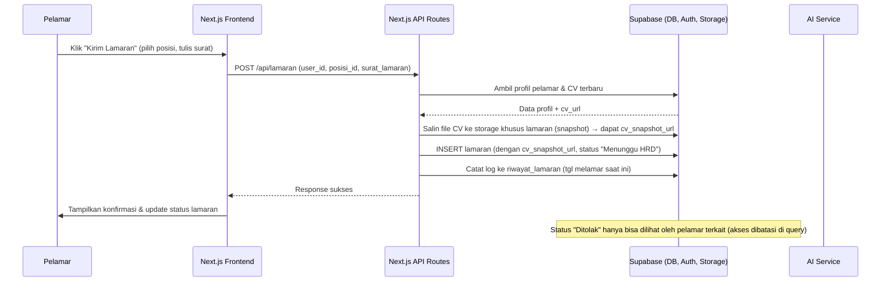
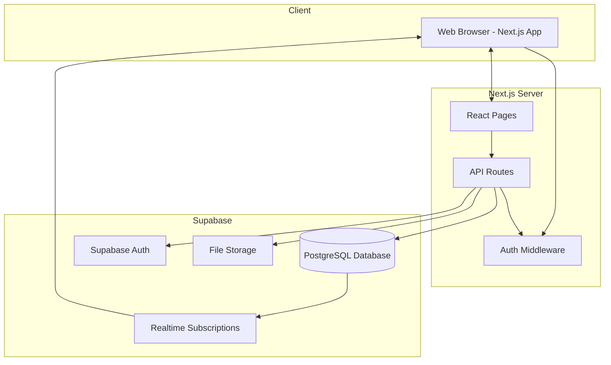
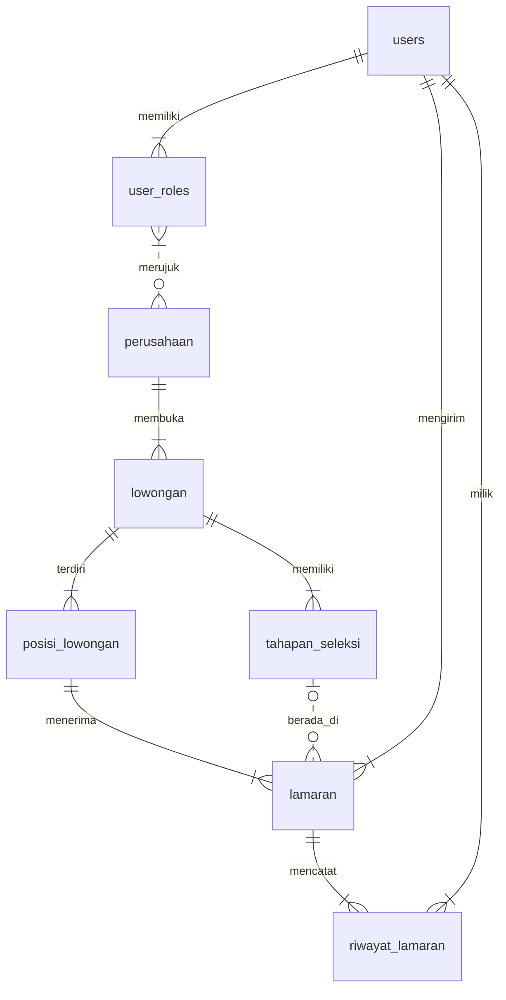

# PRD — Project Requirements Document

## 1. Overview
Portal Bursa Kerja Kampus **KerjaKink** hadir untuk menyelesaikan masalah klasik di lingkungan kampus: data lowongan yang berantakan, lamaran mahasiswa yang tercecer, serta sulitnya merekam data penyerapan alumni untuk akreditasi. Saat ini, staf BKK menyebar lowongan lewat grup WhatsApp, mahasiswa mengirim lamaran ke email pribadi, dan Kepala BKK kewalahan merekap siapa yang sudah bekerja secara manual.

Aplikasi ini akan menjadi **satu‑satunya pintu resmi** bagi mahasiswa dan alumni untuk mencari kerja, bagi perusahaan untuk merekrut, dan bagi BKK untuk memverifikasi perusahaan serta mengumpulkan data **tracer study** secara otomatis. Dengan alur yang terpusat, risiko penipuan lowongan berkurang, berkas lamaran tidak hilang, privasi pelamar terjaga, dan pelaporan akreditasi menjadi jauh lebih mudah.

## 2. Requirements
Berikut persyaratan utama yang harus dipenuhi proyek:

- **Multi‑Role & Single Account** – Satu akun dapat memiliki lebih dari satu peran (Pelamar & HRD). Pengguna bisa berpindah peran tanpa harus logout.
- **Dynamic Stages & Multi‑Position** – Satu lowongan bisa memuat banyak posisi dengan kuota berbeda. Setiap lowongan juga memiliki tahapan seleksi yang fleksibel (2 hingga 7+ tahap).
- **Snapshot CV & Privasi Status** – Saat melamar, CV disalin (snapshot) sehingga perubahan profil tidak mempengaruhi lamaran yang sudah dikirim. Status penolakan hanya terlihat oleh pelamar yang bersangkutan. Lowongan yang sudah kadaluarsa atau kuota penuh disembunyikan dari publik, tetapi lamaran yang tersisa tetap masuk dalam *talent pool* dengan status “Menunggu HRD”.
- **Data Tracer Study** – Setiap kali status lamaran berubah menjadi “Diterima”, sistem otomatis mencatat tanggal lulus, tanggal melamar, tanggal diterima, bidang pekerjaan, dan gaji awal ke dalam tabel riwayat untuk keperluan akreditasi.
- **Pencarian & Filter** – Lowongan dapat dicari dan difilter tanpa harus login.
- **Dashboard Analitik** – Tersedia ringkasan statistik untuk Admin BKK (serapan alumni, waktu tunggu, dll.) dan untuk HRD (kandidat per lowongan, kuota tersisa).
- **Notifikasi Real‑time** – Pemberitahuan perubahan status lamaran langsung muncul di aplikasi.
- **Validasi Form & Responsive UI** – Setiap input dilengkapi validasi (misal border merah jika kosong) dan tampilan nyaman di desktop maupun mobile.
- **Asisten Karir AI (Chatbot)** – Tombol obrolan mengambang yang bisa menjawab pertanyaan seputar karir, menyusun CV, atau merekomendasikan lowongan.

## 3. Core Features
Fitur‑fitur inti disusun sesuai roadmap pengembangan:

### Fase 1 – Pencarian Lowongan (Publik)
1. **Daftar Lowongan** – Kartu lowongan ringkas (posisi, perusahaan, batas waktu) yang dapat dijelajahi tanpa login.
2. **Pencarian & Filter** – Filter berdasarkan kata kunci, bidang, lokasi, atau jenis pekerjaan.
3. **Detail Lowongan & Posisi** – Halaman lengkap satu lowongan: deskripsi, posisi yang dibuka, kuota, dan tahapan seleksi.

### Fase 2 – Lamaran, Profil, & Autentikasi
4. **Profil & Unggah CV** – Isi data diri, pendidikan, pengalaman, dan unggah CV utama.
5. **Kirim Lamaran** – Pilih posisi, sesuaikan surat lamaran, lalu kirim dengan snapshot CV.
6. **Riwayat & Status Lamaran** – Daftar lamaran beserta status (menunggu, diterima, ditolak) yang bersifat privat.
7. **Notifikasi Status** – Perubahan status lamaran dikirim secara real‑time.
8. **Daftar Akun** – Registrasi sebagai pelamar atau HRD (data perusahaan menunggu verifikasi).
9. **Login & Kelola Profil** – Masuk dengan email/password, edit data diri.
10. **Switch Role** – Tombol berganti peran antara Pelamar dan HRD tanpa logout.

### Fase 3 – Manajemen Lowongan & Verifikasi Perusahaan
11. **Buat & Edit Lowongan (HRD)** – Isi detail lowongan, tambah lebih dari satu posisi dengan kuota masing‑masing.
12. **Atur Tahapan Seleksi (HRD)** – Tambah, ubah, hapus tahapan rekrutmen dinamis per lowongan.
13. **Kelola Kandidat & Progress (HRD)** – Lihat pelamar per posisi, pindahkan antar tahapan, tandai hasil akhir.
14. **Penutupan Lowongan (HRD)** – Menutup lowongan secara manual/otomatis saat kuota penuh.
15. **Antrean Verifikasi (Admin)** – Daftar perusahaan baru beserta dokumen pendukung.
16. **Verifikasi & Status Perusahaan (Admin)** – Setujui, tolak, atau masukkan ke daftar hitam (blacklist).
17. **Manajemen Data Perusahaan (Admin)** – Sunting profil perusahaan terverifikasi.

### Fase 4 – Dashboard Analitik & Tracer Study
18. **Dashboard Admin BKK** – Grafik serapan alumni, waktu tunggu, sebaran bidang, gaji awal, diambil dari log otomatis status “Diterima”.
19. **Dashboard HRD** – Ringkasan kandidat per lowongan, posisi kosong, progres rekrutmen.
20. **Laporan Akreditasi** – Unduh data tracer study 2 tahun dalam format siap unggah.

### Fase 5 – Asisten Karir AI
21. **Chatbot Pop‑up** – Tombol mengambang, bisa tanya tips karir, syarat lowongan, atau saran surat lamaran.
22. **Rekomendasi Pintar** – AI otomatis menyarankan lowongan yang cocok dengan profil dan riwayat pelamar.

## 4. User Flow
Berikut perjalanan pengguna untuk tiga alur utama:

### Pelamar (Pencari Kerja)
1. Buka halaman utama → jelajahi atau cari lowongan (tanpa login).
2. Klik lowongan → lihat detail, posisi yang dibuka, dan tahapan seleksi.
3. Untuk melamar, daftar/login sebagai Pelamar.
4. Lengkapi profil dan unggah CV di halaman profil.
5. Kembali ke lowongan, pilih posisi, tulis surat lamaran → **Kirim Lamaran**. Sistem mengambil snapshot CV.
6. Pantau status lamaran di halaman “Riwayat Lamaran”; dapat notifikasi setiap perubahan.
7. (Opsional) Jika akun juga terdaftar sebagai HRD, bisa menekan tombol **Switch Role** untuk masuk ke tampilan HRD.

### HRD Perusahaan
1. Daftar sebagai HRD → isi data perusahaan & unggah dokumen pendukung.
2. Tunggu verifikasi Admin BKK (bisa memantau status di profil).
3. Setelah *Verified*, buat lowongan baru: isi deskripsi, tambah beberapa posisi & kuota, lalu atur tahapan seleksi (misal: Administrasi → Tes → Wawancara).
4. Lihat kandidat masuk per posisi, pindahkan mereka antar tahapan, tandai Diterima/Ditolak.
5. Lowongan otomatis tertutup jika semua kuota terpenuhi; HRD bisa menutupnya manual kapan saja.
6. Buka dashboard untuk ringkasan rekrutmen.

### Admin BKK
1. Login sebagai Admin.
2. Buka antrean verifikasi perusahaan → periksa dokumen → klik *Verified*, *Tolak*, atau *Blacklist*.
3. Pantau seluruh aktivitas lewat dashboard serapan alumni, unduh laporan akreditasi.
4. Sesekali perbarui data perusahaan jika ada perubahan resmi.

## 5. Architecture
Sistem menggunakan arsitektur **Next.js full‑stack** dengan **Supabase** sebagai backend‑as‑a‑service. Diagram berikut menunjukkan alur utama ketika seorang pelamar mengirim lamaran dan sistem merekam snapshot CV.

Diagram berikut menunjukkan komunikasi antar komponen utama sistem.

- **Next.js (Frontend + Backend)** menyatukan antarmuka pengguna dan logika server dalam satu proyek.
- **Supabase** menyediakan basis data, autentikasi, penyimpanan file, dan notifikasi *realtime* untuk perubahan status lamaran.
- **AI Service** (diakses dari API route) menangani fitur chatbot dan rekomendasi lowongan.

## 6. Database Schema
Berikut tabel utama yang diperlukan. Tabel `riwayat_lamaran` berperan sebagai *fact table* untuk tracer study, mencatat snapshot data setiap kali status lamaran menjadi “Diterima”.

### Tabel Penting

**users**
| Kolom       | Tipe      | Kegunaan                              |
|-------------|-----------|---------------------------------------|
| id          | UUID      | Primary key                           |
| email       | string    | Alamat email untuk login              |
| password    | string    | (dikelola Supabase Auth)              |
| nama_lengkap| string    |                                       |
| ...         |           |                                       |

**user_roles**
| Kolom    | Tipe   | Kegunaan                              |
|----------|--------|---------------------------------------|
| id       | UUID   |                                       |
| user_id  | UUID   | FK ke users                           |
| role     | enum   | 'pelamar', 'hrd', 'admin'            |
| perusahaan_id | UUID? | FK ke perusahaan (jika role hrd)     |

**perusahaan**
| Kolom       | Tipe   | Kegunaan                              |
|-------------|--------|---------------------------------------|
| id          | UUID   |                                       |
| nama        | string |                                       |
| deskripsi   | text   |                                       |
| status_verifikasi | enum | 'pending', 'verified', 'blacklist' |
| dokumen_pendukung | string?| URL dokumen verifikasi            |

**lowongan**
| Kolom         | Tipe     | Kegunaan                           |
|---------------|----------|------------------------------------|
| id            | UUID     |                                    |
| perusahaan_id | UUID     | FK                                 |
| judul         | string   |                                    |
| deskripsi     | text     |                                    |
| batas_waktu   | datetime |                                    |
| is_closed     | boolean  | Default false                      |

**posisi_lowongan**
| Kolom       | Tipe   | Kegunaan                              |
|-------------|--------|---------------------------------------|
| id          | UUID   |                                       |
| lowongan_id | UUID   | FK ke lowongan                        |
| nama_posisi | string |                                       |
| kuota       | integer|                                       |
| terisi      | integer| (dihitung dari lamaran diterima)      |

**tahapan_seleksi**
| Kolom       | Tipe    | Kegunaan                             |
|-------------|---------|--------------------------------------|
| id          | UUID    |                                      |
| lowongan_id | UUID    | FK                                   |
| urutan      | integer | Urutan tahap (1,2,3...)              |
| nama_tahap  | string  | Contoh: "Administrasi", "Wawancara"  |

**lamaran**
| Kolom            | Tipe     | Kegunaan                               |
|------------------|----------|----------------------------------------|
| id               | UUID     |                                        |
| user_id          | UUID     | FK ke users (pelamar)                  |
| posisi_id        | UUID     | FK ke posisi_lowongan                  |
| tahapan_id       | UUID?    | FK ke tahapan_seleksi (tahap saat ini) |
| status           | enum     | 'menunggu', 'diterima', 'ditolak'      |
| cv_snapshot_url  | string   | Salinan CV saat melamar                |
| surat_lamaran    | text     |                                        |
| tgl_melamar      | datetime |                                        |

**riwayat_lamaran** (Tracer Study)
| Kolom          | Tipe     | Kegunaan                                   |
|----------------|----------|--------------------------------------------|
| id             | UUID     |                                            |
| lamaran_id     | UUID     | FK ke lamaran                              |
| user_id        | UUID     | FK ke users (alumni)                       |
| posisi_id      | UUID     | FK ke posisi_lowongan (untuk bidang)       |
| tgl_lulus      | date     | Diambil dari profil pelamar                |
| tgl_melamar    | date     | Diambil dari lamaran                       |
| tgl_diterima   | date     | Saat status diubah menjadi 'diterima'      |
| bidang_pekerjaan | string | Berdasarkan posisi/loker                 |
| gaji_awal      | integer  | Diisi oleh HRD/Admin saat diterima? (atau dari lowongan) |

### Diagram ER

**Catatan Tambahan:**
- Skema di atas masih bersifat high‑level; pada implementasi detail tipe data dan constraint akan ditentukan lebih lanjut.
- Tabel `notifikasi` dapat ditambahkan untuk menyimpan log pemberitahuan real‑time.

## 7. Tech Stack
Rekomendasi teknologi untuk membangun **KerjaKink**:

- **Frontend & Backend Framework:** Next.js — menyatukan React UI dan API route berbasis Node.js dalam satu proyek.
- **Basis Data & Backend‑as‑a‑Service:** Supabase
  - **PostgreSQL** untuk penyimpanan data relasional.
  - **Supabase Auth** untuk autentikasi email/password dan manajemen user.
  - **Supabase Storage** untuk penyimpanan CV dan dokumen perusahaan.
  - **Supabase Realtime** untuk notifikasi perubahan status lamaran secara langsung.
- **UI & Styling:** Tailwind CSS + shadcn/ui — komponen siap pakai yang modern dan mudah dikustomisasi.
- **ORM (Opsional):** Drizzle ORM — type‑safe, cocok untuk PostgreSQL di Next.js.
- **AI Provider / Gateway:** OpenAI API — digunakan untuk fitur chatbot rekomendasi dan asisten karir. Dipanggil dari API routes Next.js.
- **Deployment:** Vercel (hosting Next.js yang optimal) + Supabase (managed service). Alternatif: Netlify atau platform lain yang mendukung Node.js.

Semua komponen dipilih agar tim dapat bergerak cepat, dengan biaya awal rendah (paket gratis Vercel & Supabase mencukupi untuk tahap awal), serta mudah diskalakan seiring pertumbuhan pengguna.